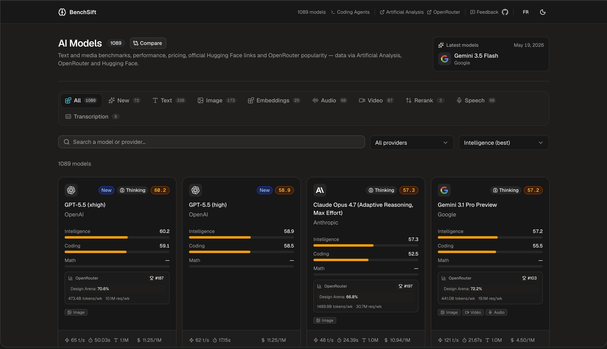

# BenchSift

There are hundreds of AI models out there. This is a simple tool to help you pick the right one text and media benchmarks, speed, pricing, context windows, all in one place.



Data comes from [Artificial Analysis](https://artificialanalysis.ai), [OpenRouter](https://openrouter.ai), and [Hugging Face](https://huggingface.co), refreshed every hour.

## Features

- **Model catalogue** — browse text, image, voice, video and utility models with key stats at a glance
- **Side-by-side comparison** — pick up to several models and compare them on every metric
- **Detailed model pages** — context window, output speed, pricing, text benchmarks (MMLU, HumanEval, MATH…) and media ELO benchmarks when Artificial Analysis exposes them
- **Search & filter** — find models by name or provider instantly
- **Light/dark theme** — persisted across sessions
- **French & English** — language auto-detected, switchable in one click
- **No account required** — language, theme and comparison preferences stay in the browser

## Getting started

```bash
npm install
cp .env.example .env   # then fill in your API keys
npm run dev
```

Then open [http://localhost:3000](http://localhost:3000)

You'll need an Artificial Analysis API key — grab one at [artificialanalysis.ai](https://artificialanalysis.ai) and add it to `.env`:

```env
ARTIFICIAL_ANALYSIS_API_KEY=your_key_here
OPENROUTER_API_KEY=your_openrouter_key_here
```

OpenRouter is used for model metadata, weekly usage rankings and benchmark enrichment.
`OPENROUTER_API_KEY` is optional, but enables authenticated `/api/v1/models` requests
instead of relying on the unauthenticated public path.
Hugging Face is used only for official model repository metadata and links.

## Project structure

```
src/
  router.tsx              # Router instance
  routes/
    __root.tsx            # Root layout, <head>, providers, error boundary
    index.tsx             # Homepage — model grid
    compare.tsx           # Side-by-side comparison
    agents/coding.tsx     # Coding-agents leaderboard
    models/$slug.tsx      # Model detail page
    api/cron/refresh.ts   # Manual cache-refresh endpoint
    robots[.]txt.ts       # robots.txt
    sitemap[.]xml.ts      # sitemap.xml
  styles/globals.css      # Tailwind v4 entry
components/               # UI components (shadcn/ui based)
lib/
  api.ts                  # Data fetching (Artificial Analysis + OpenRouter) — server only
  server-fns.ts           # TanStack Start server functions (route loaders)
  revalidate-cache.ts     # Revalidating in-memory cache
  cron-cache.ts           # Persisted models cache for Node/Dokploy
  coding-agents.ts        # Coding-agent types + harness metadata (client-safe)
  i18n.tsx                # French/English translations
  compare-store.tsx       # Client-side comparison state
```

## Built with

- [TanStack Start](https://tanstack.com/start/latest) — full-stack React framework
- [TanStack Router](https://tanstack.com/router) — type-safe file-based routing
- [React 19](https://react.dev)
- [Vite 7](https://vite.dev)
- [Tailwind CSS v4](https://tailwindcss.com)
- [shadcn/ui](https://ui.shadcn.com) + [Radix UI](https://radix-ui.com)
- [Nitro](https://nitro.build) — Node server output for Docker/Dokploy

## Deploying

This branch targets [Dokploy](https://dokploy.com) as a Node/Docker service.
The production server is generated by Nitro:

```bash
npm run build
npm run start
```

`npm run start` runs:

```bash
node .output/server/index.mjs
```

Dokploy can use the included `Dockerfile`. Configure:

- Internal port: `3000`
- Environment variables: `ARTIFICIAL_ANALYSIS_API_KEY`, optional fallback AA keys,
  `OPENROUTER_API_KEY`, `HUGGINGFACE_API_KEY`, and `CRON_SECRET`
- Optional volume: mount `/app/.data` so `.data/models-cache.json` survives
  redeploys
- Health check: use `http://localhost:3000/health`
- Scheduler: create a Dokploy Application Schedule Job that runs
  `npm run refresh-cache` inside the running container
