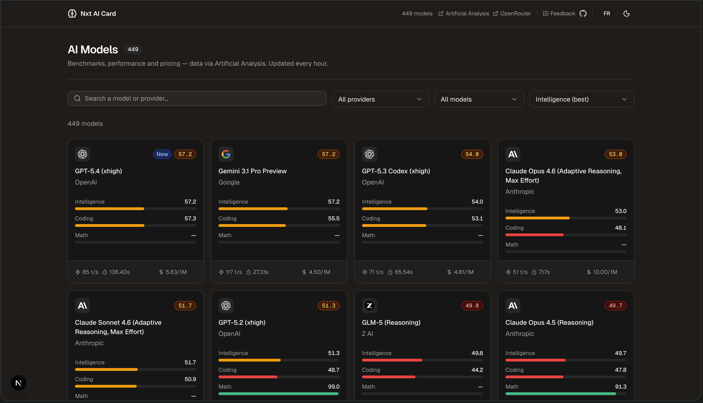

# Nxt AI Card

There are hundreds of LLMs out there. This is a simple tool to help you pick the right one — benchmarks, speed, pricing, context windows, all in one place.



Data comes from [Artificial Analysis](https://artificialanalysis.ai) and [OpenRouter](https://openrouter.ai), refreshed every hour.

## Features

- **Model catalogue** — browse all major LLMs with key stats at a glance
- **Side-by-side comparison** — pick up to several models and compare them on every metric
- **Detailed model pages** — context window, output speed, pricing (input/output tokens), quality benchmarks (MMLU, HumanEval, MATH…)
- **Search & filter** — find models by name or provider instantly
- **Light/dark theme** — persisted across sessions
- **French & English** — language auto-detected, switchable in one click
- **No tracking** — no analytics, no personal data collected

## Getting started

```bash
npm install
cp .env.example .env.local
npm run dev
```

Then open [http://localhost:3000](http://localhost:3000).

You'll need an Artificial Analysis API key — grab one at [artificialanalysis.ai](https://artificialanalysis.ai) and add it to `.env.local`:

```env
ARTIFICIAL_ANALYSIS_API_KEY=your_key_here
```

OpenRouter is used without an API key (public endpoint).

## Project structure

```
app/
  page.tsx              # Homepage — model grid
  models/[slug]/        # Model detail page
  compare/              # Side-by-side comparison
components/             # UI components (shadcn/ui based)
lib/
  api.ts                # Data fetching (Artificial Analysis + OpenRouter)
  i18n.tsx              # French/English translations
  compare-store.tsx     # Client-side comparison state
```

## Built with

- [Next.js 16](https://nextjs.org) (App Router, Server Components)
- [React 19](https://react.dev)
- [Tailwind CSS v4](https://tailwindcss.com)
- [shadcn/ui](https://ui.shadcn.com)
- [Radix UI](https://radix-ui.com)

## Deploying

```bash
npm run build
npm run start
```

Works on Vercel, Railway, or any Node.js host. Set the `ARTIFICIAL_ANALYSIS_API_KEY` environment variable in your deployment dashboard.v
