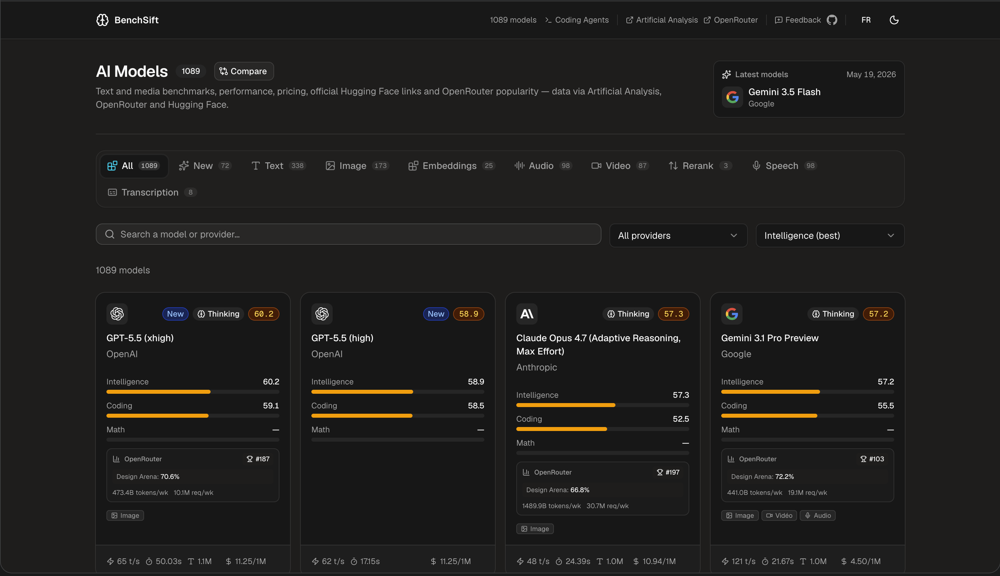

# BenchSift

BenchSift helps you compare AI models using text and media benchmarks, speed, pricing, and context windows.



Data comes from [Artificial Analysis](https://artificialanalysis.ai), [OpenRouter](https://openrouter.ai), and [Hugging Face](https://huggingface.co). Refresh frequency depends on the deployment schedule; see [DOKPLOY.md](DOKPLOY.md#schedule-job).

## Features

- **Model catalogue** — browse text, image, voice, video and utility models with key stats at a glance
- **Side-by-side comparison** — pick up to several models and compare them on every metric
- **Detailed model pages** — context window, output speed, pricing, text benchmarks (MMLU, HumanEval, MATH…) and media ELO benchmarks when Artificial Analysis exposes them
- **Search & filter** — find models by name or provider instantly
- **Light/dark theme** — persisted across sessions
- **French & English** — language auto-detected, switchable in one click
- **No account required** — language, theme and comparison preferences stay in the browser

## Getting started

Use the Bun version declared in `package.json` (also used by `Dockerfile`).

```bash
bun install
cp .env.example .env   # then fill in your API keys
bun run dev
```

Then open [http://localhost:3000](http://localhost:3000)

You'll need an Artificial Analysis API key — create one from the [Data API](https://artificialanalysis.ai/data-api) and add it to `.env`:

```env
ARTIFICIAL_ANALYSIS_API_KEY=your_key_here
OPENROUTER_API_KEY=your_openrouter_key_here
```

OpenRouter is used for model metadata, weekly usage rankings and benchmark enrichment.
`OPENROUTER_API_KEY` is optional, but enables authenticated `/api/v1/models` requests
instead of relying on the unauthenticated public path.
Hugging Face is used only for official model repository metadata and links.
The Artificial Analysis integration uses the supported V2 endpoints, paginates the
complete language-model catalogue, and automatically uses the richer Pro or
Commercial response when the configured key grants access.

## Project structure

```
src/
  router.tsx              # Router instance
  routes/
    __root.tsx            # Root layout, <head>, providers, error boundary
    index.tsx             # Homepage — catalogue and rankings
    compare.tsx           # Side-by-side comparison
    agents/coding.tsx     # Coding-agents leaderboard
    models/$slug.tsx      # Model detail page
    api/cron/refresh.ts   # Authenticated cache-refresh endpoint
    api/cron/status.ts    # Authenticated cache summary
    health.ts            # Public liveness and catalogue state
    robots[.]txt.ts       # robots.txt
    sitemap[.]xml.ts      # sitemap.xml
  styles/globals.css      # Tailwind v4 entry
components/               # UI components (shadcn/ui based)
lib/
  api.ts                  # Catalogue ingestion and enrichment — server only
  server-fns.ts           # TanStack Start server functions (route loaders)
  revalidate-cache.ts     # Revalidating in-memory cache
  cron-cache.ts           # Persisted models cache for Bun/Dokploy
  home-catalog.ts         # Lightweight homepage payload
  model-reasoning.ts      # Reasoning families and Normal-mode collapse
  provider-map.ts         # Canonical creators/providers
  openrouter-model-filter.ts # OpenRouter model exclusions
  coding-agents.ts        # Coding-agent types + harness metadata (client-safe)
  i18n.tsx                # French/English translations
  compare-store.tsx       # Client-side comparison state
```

## Built with

- [TanStack Start](https://tanstack.com/start/latest) — full-stack React framework
- [TanStack Router](https://tanstack.com/router) — type-safe file-based routing
- [React 19](https://react.dev)
- [Vite 8](https://vite.dev)
- [Tailwind CSS v4](https://tailwindcss.com)
- [shadcn/ui](https://ui.shadcn.com) + [Radix UI](https://radix-ui.com)
- [Nitro](https://nitro.build) — server output run by Bun in Docker/Dokploy

## Validation and contribution

[AGENTS.md](AGENTS.md) defines repository contracts and checks by change type.
[PRODUCT.md](PRODUCT.md) describes the intended UI and interaction behavior.
Use [SECURITY.md](SECURITY.md) to report vulnerabilities privately.

## Deploying

Build and run the production server locally with:

```bash
bun run build
bun run start
```

`start` runs `bun .output/server/index.mjs`. The included Dockerfile packages
this service for Dokploy. See [DOKPLOY.md](DOKPLOY.md) for environment variables,
persistent storage, scheduling, and deployment verification.
